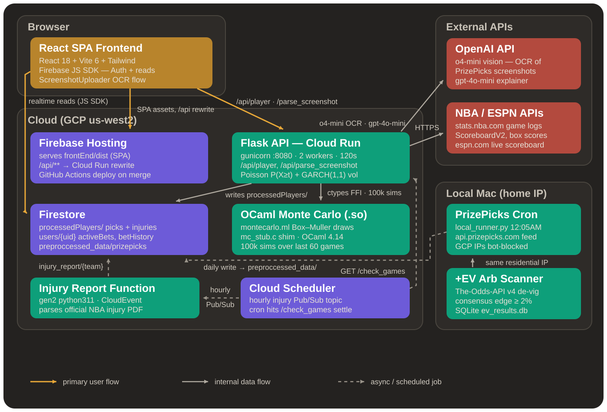
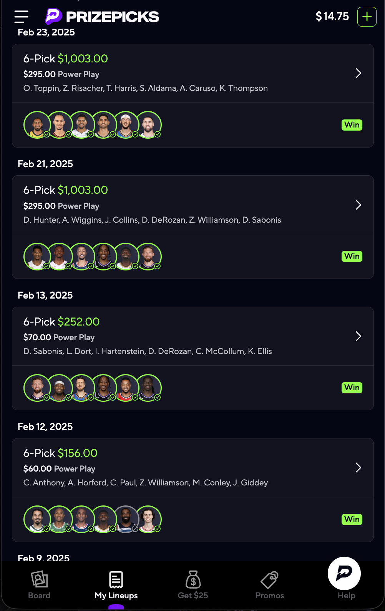
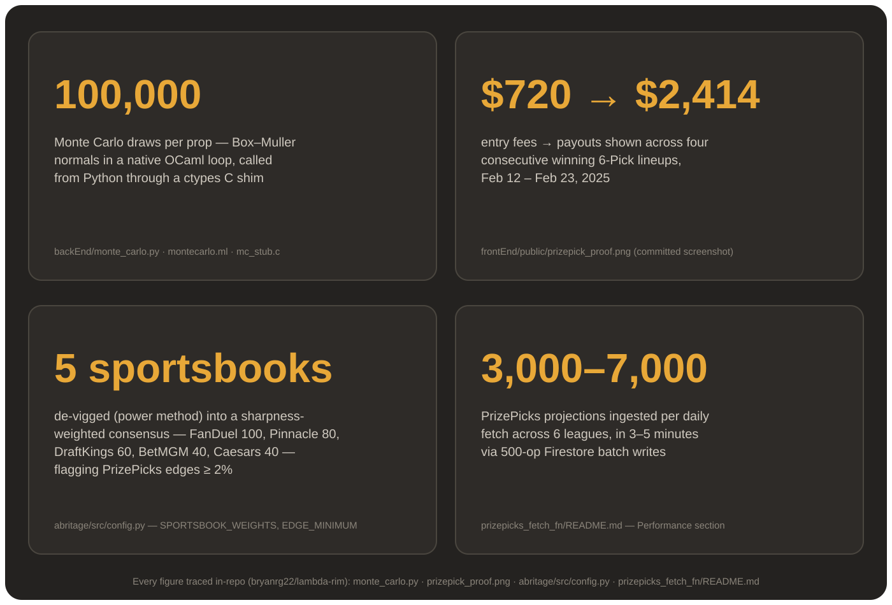
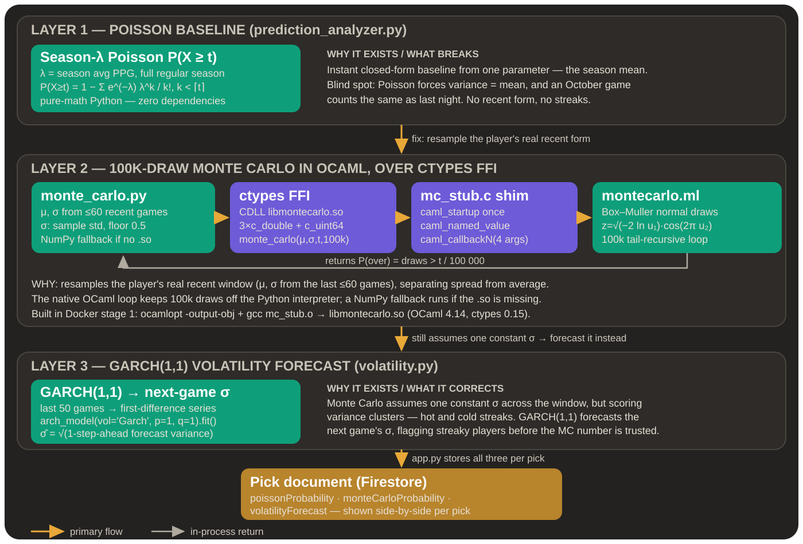

# Lambda Rim – *Quantitative Fantasy Sports Analytics Platform*


---

> **If they use Math, why can't we?**

---

## System Architecture



## What is Lambda Rim?

Lambda Rim analyzes a **Fantasy Sports Pick**, and answers one burning question:

> **“Is the *****'over'***** worth my money?”**

Behind that single answer sits a full pipeline—OCR → feature engineering → probabilistic models through machine learning and statistics → natural‑language rationale—served by a **Flask API** on Google **Cloud Run**.

---

## 🚀 Current Project Overview

- **Objective:** Predict NBA Player 'Point' performances (“Over” Picks) using Statistical models (Poisson, Monte Carlo, GARCH volatility) and AI-driven explanations.  
- **Core Features:**  
  - **Screenshot Parsing (OCR):** Upload PrizePicks cards, extract player & threshold pairs.  
  - **Player Pipeline:**  
    - Player Data and Stats (Recent Games, Team v Opponent, etc) 
    - Poisson Probability
    - Monte Carlo Simulation
    - GARCH Volatility Forecast
    - Injury Report Scraping
    - Importance Scoring (usage rate, Importance Score) to label Starter/Rotation/Bench
    - ChatGPT-powered Bet Explanation
  - **Playoff Support:** Automatically switches to playoff stats after ≥ 5 postseason games.  
  - **Real-Time Updates:** Background Cloud Functions mark "Concluded" games and settle bets, scrape official NBA Injury Report for up-to-date injury information. PrizePicks betting lines are automatically fetched daily via a local cron job (see note below).  
  - **CI/CD & Hosting:** React + Vite on Firebase Hosting, Flask + Docker on Cloud Run, GitHub Actions auto-deploy.
  - **+EV Arbitrage Scanner:** Detects positive expected value betting opportunities by comparing PrizePicks lines against sportsbook consensus odds (de-vigged via the power method). Multi-league support (NBA, NFL, NHL, MLB, CBB, CFB).

---

### Results





---

## 🛠️ Tech Stack at a Glance
![Python] ![OCaml] ![ChatGPT] ![Flask] ![React] ![TailwindCSS] ![Google Cloud] ![Pandas] ![Firebase]

### ☁️ Back-End  
- **Python** - BackEnd Engine
- **OCaml** - Monte Carlo Engine
- **Flask** – REST API  
- **gunicorn** – WSGI server (Cloud Run)  
- **firebase-admin** – Firestore & Auth  
- **openai** – ChatGPT o4-mini integration

### 📊 +EV Arbitrage Scanner
- **Python** – Core detection pipeline
- **scipy** – Power‑method de‑vig (Brentq root‑finding)
- **rapidfuzz** – Fuzzy player‑name matching
- **The‑Odds‑API** – Multi‑book sportsbook odds
- **SQLite** – Local caching & results persistence

### 📈 Data & Analytics
- **Poisson & Monte Carlo** – Probability pipelines  
- **GARCH (arch-model)** – Volatility forecasting  
- **pandas, NumPy** – Data wrangling  
- **NBA API** – Stats & box scores  
- **OCR (screenshot_parser.py)** – Image data extraction  
- **Requests** – Web scraping (NBA Injury Report)  
- **ML Pipeline (In Progress)** – Ensemble models trained on historical player picks stored in Firestore

### 🏙️ Infrastructure & Deployment  
- **Firebase Hosting** – Front-end CDN & SSL  
- **Google Cloud Run** – Containerized Flask API  
- **Firebase Cloud Functions** – Background jobs & data migration (injury reports)  
- **Local Cron Jobs** – PrizePicks data fetch (runs locally due to IP blocking - see below)  
- **GitHub Actions** – CI/CD (build → deploy Hosting & Cloud Run)  
- **Docker** – Back-end container

---

##  System Architecture

```
┌─────────────────────────────────────────────────────────┐
│                    USER INTERFACE                       │
├─────────────────────────────────────────────────────────┤
│  • Dashboard Overview (Earnings, Active Bets)           │
│  • Player Analysis Panel (Input + Results)              │
│  • Processed Players Dashboard                          │
│  • Admin Analytics & Monitoring                         │
└──────────────────────────┬──────────────────────────────┘
                           │
┌──────────────────────────▼──────────────────────────────┐
│                    REACT FRONTEND                       │
├─────────────────────────────────────────────────────────┤
│  • Components (UI Logic) - Tailwind CSS                 │
│  • State Mgmt (React Hooks + Firebase Auth)             │
│  • API Service (HTTP Calls to Flask)                    │
│  • Real-time Updates (Firebase SDK)                     │
└──────────────────────────┬──────────────────────────────┘
                           │
┌──────────────────────────▼──────────────────────────────┐
│                    FLASK BACKEND                        │
├─────────────────────────────────────────────────────────┤
│  • API Routes (Endpoints) - Player Analysis, OCR        │
│  • Business Logic - Statistical Models & AI             │
│  • Data Processing - pandas, NumPy, NBA API             │
│  • External Integrations - OpenAI, Web Scraping         │
└──────────────────────────┬──────────────────────────────┘
                           │
┌──────────────────────────▼──────────────────────────────┐
│                GOOGLE CLOUD FUNCTIONS                   │
├─────────────────────────────────────────────────────────┤
│  • Settlement Pipeline (Auto-archive bets)              │
│  • Data Migration & Database Maintenance                │
│  • Injury Report Updates (Scheduled - Hourly)           │
│  • Background Analytics Computation                     │
│  • Cloud Scheduler Triggers                             │
└──────────────────────────┬──────────────────────────────┘
                           │
┌──────────────────────────▼──────────────────────────────┐
│                LOCAL CRON JOBS                          │
├─────────────────────────────────────────────────────────┤
│  • PrizePicks Data Fetch (Daily 12:05 AM PT)            │
│  • Runs locally due to PrizePicks IP blocking           │
│  • Multi-league support (NBA, NFL, Soccer, NHL, etc.)   │
└──────────────────────────┬──────────────────────────────┘
                           │
┌──────────────────────────▼──────────────────────────────┐
│                  FIRESTORE DATABASE                     │
├─────────────────────────────────────────────────────────┤
│  • processedPlayers/ (active/concluded)                 │
│  • users/{userId}/ (activeBets/betHistory)              │
│  • admin/ (analytics/monitoring/reports)                │
│  • injury_report/ (team-specific data)                  │
│  • preproccessed_data/prizepicks/ (daily betting lines) │
└─────────────────────────────────────────────────────────┘
```

---

##  Automated OCR to Prediction Pipeline


---

##  Google Cloud Functions Architecture


**Note on PrizePicks Data Fetch:** The PrizePicks data fetch was migrated from a Cloud Function to a local cron job. PrizePicks uses bot protection that blocks requests from cloud provider IP ranges (GCP, AWS, etc.), so the script now runs locally on a scheduled cron job to use a residential IP address. See `prizepicks_fetch_fn/README.md` for details.

---

## 📊 More on the Probability & Forecasting Methods

Below is a quick reference on how each analytical value is produced inside the player documents.



### 🔢 Poisson Probability (`poissonProbability`)
- **Data window:** *All* regular‑season games from the current season  
- **Library:** Native Python `math` (no external deps)  
- **Computation:**  
  - Calculate the season scoring average `λ`  
  - Evaluate $$P(X \ge t) \;=\; 1 - \sum_{k=0}^{\lceil t\rceil-1} \frac{e^{-\lambda}\lambda^{k}}{k!}$$  
    where **`t`** is the user‑selected points threshold  
- **Interpretation:** Purely distribution‑based likelihood a player scores **over** the line given their season‑long mean

---

### 🎲 Monte Carlo Probability (`monteCarloProbability`)
- **Data window:** Up to **60** most‑recent games (regular *and* playoff)  
- **Stats used:** sample mean `μ` & standard deviation `σ`  
- **Simulations:** **100 000** random seasons per query  
- **OCaml Engine:** Routine exposed through a C shared library (`mc_stub.c`) for speed efficiency
- **Output:** Fraction of simulations where the random score ≥ user threshold  
- **Why Monte Carlo?** Captures hot/cold streaks and non‑Gaussian tails better than a single closed‑form model

---

### 📈 GARCH Volatility Forecast
- **Data window:** **Last 50** games
- **Library:** [`arch`](https://github.com/bashtage/arch) – fits a **GARCH(1,1)** model  
- **Pipeline:**  
  1. Convert the points series to “returns” via first differences  
  2. Fit GARCH(1,1) on those returns  
  3. Return the 1‑step‑ahead forecasted **σ** (square‑root of the predicted variance)  
- **Interpretation:** Forward‑looking volatility that reflects clustering of high‑variance performances

---

Together, these three metrics give a balanced outlook:

| Metric | Scope | Strength |
| ------ | ----- | -------- |
| **Poisson** | Season‑long | Fast analytical baseline |
| **Monte Carlo** | Last ≤ 60 games | Empirical tail‑risk capture |
| **GARCH σ** | Last 50 games | Short‑run variance / streak detection |


---

## +EV Arbitrage Detection System

The `abritage/` directory contains a **standalone proof‑of‑concept** that detects +EV (positive expected value) betting opportunities by comparing PrizePicks lines against sharp sportsbook consensus odds.

### How It Works

```
┌──────────────────┐     ┌──────────────────────┐
│   PrizePicks API │     │   The‑Odds‑API       │
│  (projections)   │     │  (multi‑book odds)   │
└────────┬─────────┘     └──────────┬───────────┘
         │                          │
         ▼                          ▼
┌──────────────────────────────────────────────────┐
│              Player Name Matcher                 │
│   Exact → Normalized → Override → Fuzzy (≥ 85%)  │
└────────────────────────┬─────────────────────────┘
                         │
                         ▼
┌──────────────────────────────────────────────────┐
│              De‑Vig Engine (Power Method)        │
│   IP_over^k + IP_under^k = 1  (scipy brentq)     │
└────────────────────────┬─────────────────────────┘
                         │
                         ▼
┌──────────────────────────────────────────────────┐
│          Weighted Consensus Builder              │
│  FanDuel(100) · Pinnacle(80) · DraftKings(60)    │
│  BetMGM(40) · Caesars(40)                        │
└────────────────────────┬─────────────────────────┘
                         │
                         ▼
┌──────────────────────────────────────────────────┐
│              Edge Calculator                     │
│  Edge = Fair_Prob − Break_Even_Threshold         │
│  Flags opportunities with edge ≥ 2%              │
└────────────────────────┬─────────────────────────┘
                         │
                         ▼
         ┌───────────────────────────┐
         │  +EV Opportunities Table  │
         │  (SQLite / CSV / stdout)  │
         └───────────────────────────┘
```

### Key Concepts

| Concept | Description |
| ------- | ----------- |
| **De‑Vig (Power Method)** | Strips the bookmaker's margin from raw odds to recover fair probabilities. Solves for exponent *k* such that `IP_over^k + IP_under^k = 1`. |
| **Weighted Consensus** | Averages fair probabilities across books, weighting sharper books (Pinnacle, FanDuel) more heavily than softer ones. |
| **Edge Calculation** | `Edge = Fair Probability − Break‑Even Threshold`. Each PrizePicks entry type has a known break‑even (e.g., 6‑pick flex = 54.2%, 2‑pick power = 57.7%). |
| **Edge Quality** | Excellent (≥ 5%), Very Good (≥ 3%), Good (≥ 2%) |


### Supported Leagues

NBA · NFL · NHL · MLB · CBB · CFB

> **Note:** PrizePicks blocks cloud‑provider IPs, so the scanner must run from a residential IP (local machine).

---


## What Does the Future Hold for Lambda Rim ?

As the sole developer of **Lambda Rim**, I envision it evolving far beyond an NBA “over points” analyzer. I turned \$10 into \$50+ on PrizePicks just by searcing up simple stats such as averages, injury reports, and team ranks all on my iphone — I saw potential that others overlooked. What many dismiss as pure gambling, I see as a microcosm of the stock market. By mining historical data, applying statistical & machine‑learning models, and detecting hidden patterns, I’m essentially shadowing what a quant does every day.


## 🔍 Next Steps of Action

### 🤖 Advanced Machine Learning
1. **Baseline Probability Ensemble**  
   Implement Regularised Logistic Regression, LightGBM, CatBoost, and stacking meta‑models—then calibrate—to generate rock‑solid win probabilities and surface your daily “best picks.”
2. **Ticket Optimization & Correlation**  
   Use an integer‑LP optimizer and Gaussian‑copula simulation to craft the single highest‑value multi‑leg ticket.
3. **Learning to Rank**  
   Deploy LambdaMART so the system learns from past outcomes which picks should rise to the top each day.
4. **Deep & Bayesian Models**  
   - **TFT** (Temporal Fusion Transformer) to capture momentum in raw game‑stat sequences  
   - **Hierarchical Bayesian Logistic** to stabilize predictions for rookies and low‑sample players
5. **Heavy Hitters & Fine‑Tuning**  
   Build Player2Vec/TabTransformer embeddings, multi‑task neural nets for exact‑point forecasts, and playoff‑only fine‑tuning to eke out that final edge.

---

## More About Me!

**Bryan Ramirez‑Gonzalez** – 3x Hackathon Winner, First‑gen Latino, Undergrad Honors CS @ USC '28, Hackathon‑addict\
*Let’s connect →*
- Website: [bryanram.com](http://bryanram.com) - Learn More about Me Here!
- Resume: [bryanram.com/resume.pdf](http://bryanram.com/resume.pdf)
- LinkedIn: [@bryanrg22](https://linkedin.com/in/bryanrg22)
- Github: [@bryanrg22](https://github.com/bryanrg22)
- [Google Scholars](https://scholar.google.com/citations?user=x5W6xScAAAAJ&hl=en)
- Email: [bryanram2024@gmail.com](mailto:bryanram2024@gmail.com)


[Python]:       https://img.shields.io/badge/python-3670A0?style=for-the-badge&logo=python&logoColor=ffdd54
[OCaml]:        https://img.shields.io/badge/OCaml-%23E98407.svg?style=for-the-badge&logo=ocaml&logoColor=white
[ChatGPT]:      https://img.shields.io/badge/chatGPT-74aa9c?style=for-the-badge&logo=openai&logoColor=white
[Flask]:        https://img.shields.io/badge/flask-%23000.svg?style=for-the-badge&logo=flask&logoColor=white
[React]:        https://img.shields.io/badge/react-%2320232a.svg?style=for-the-badge&logo=react&logoColor=%2361DAFB
[TailwindCSS]:  https://img.shields.io/badge/TailwindCSS-38B2AC?style=for-the-badge&logo=tailwind-css&logoColor=white
[Firebase]:     https://img.shields.io/badge/firebase-ffca28?style=for-the-badge&logo=firebase&logoColor=black
[Pandas]:       https://img.shields.io/badge/pandas-%23150458.svg?style=for-the-badge&logo=pandas&logoColor=white
[Google Cloud]: https://img.shields.io/badge/GoogleCloud-%234285F4.svg?style=for-the-badge&logo=google-cloud&logoColor=white

