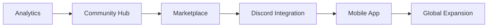

# Lambda Rim – *Because 99 % ain’t a free throw*

> **Full‑stack, AI‑powered fantasy‑sports platform that turns screenshots into edge.**

[Live Preview](https://prizepicksproject-15337.web.app/)  |  [Demo Video](https://github.com/user-attachments/assets/ec796b28-824e-4374-8d9a-beedc7a0ed4e)

---

## 🚀 What is Lambda Rim?

Lambda Rim swallows a **PrizePicks** screenshot, extracts each *player + threshold* pair, and answers one burning question:

> **“Is the *****over***** worth my money?”**

Behind that single answer sits a full pipeline—OCR → feature engineering → probabilistic models → natural‑language rationale—served by a **React + Vite front‑end** and a **Flask API** on Google **Cloud Run**. The very first \$10 entered on the platform blossomed into **\$3 279** (*29 900 % ROI, 11/14 pick streak*).

---

## 📈 Current Feature Set (2025‑07)

| Area                        | Capability                                                                                                                                                                  |
| --------------------------- | --------------------------------------------------------------------------------------------------------------------------------------------------------------------------- |
| 🖼️ **OCR Parsing**         | Drag‑&‑drop PrizePicks / Underdog screenshots & auto‑detect every card                                                                                                      |
| 🧠 **Probabilistic Models** | • **Poisson** season baseline• **100 k‑draw Monte Carlo** on last ≤ 60 games (OCaml ⚡ fall‑back NumPy)• **GARCH (1,1)** volatility forecast for hot & cold streak detection |
| 🤖 **AI Explanation**       | ChatGPT distills the stats into a 2‑sentence “why” with confidence range                                                                                                    |
| 💉 **Injury Intelligence**  | Hourly Cloud Function scrapes NBA PDF reports → real‑time status flags                                                                                                      |
| 📲 **Mobile‑first UI**      | Responsive dashboard, deep‑dive modals, infinite‑scroll history                                                                                                             |
| ⚡ **CI/CD**                 | GitHub Actions → Firebase Hosting (front‑end) & Cloud Run (API)                                                                                                             |
| 🔒 **ToS gating**           | First‑time modal ensures age & jurisdiction compliance                                                                                                                      |
| 🔁 **Auto‑settlement**      | Scheduled job hits live box scores → flips bets to *concluded* & records P/L                                                                                                |

---

## 🛠️ Tech Stack at a Glance

**Front‑End** React / Vite • Tailwind CSS • Recharts • Lucide React\
**Back‑End** Python 3.9 • Flask • Gunicorn • Firebase‑Admin • OCaml (MC engine)\
**ML / Data** Poisson • Monte Carlo • GARCH (arch) • pandas / NumPy • nba\_api\
**Infra** Google Cloud Run • Firebase Hosting & Functions • Docker • GitHub Actions

---

## 🗺️ Roadmap

### 1. Machine‑Learning Sprints

| Sprint                        | ID              | Model                                            | Adds                        | Status        |
| ----------------------------- | --------------- | ------------------------------------------------ | --------------------------- | ------------- |
| **Sprint 1**Baseline Ensemble | M1              | *Regularised LogReg*                             | Fast, interpretable P(over) | ⬜ Q3 2025     |
|                               | M2              | *LightGBM (GOSS)*                                | Non‑linear interactions     | ⬜ Q3 2025     |
|                               | M3              | *CatBoost*                                       | Categorical mastery         | ⬜ Q3 2025     |
|                               | M4              | *Logistic Stacker*                               | Blended AUC boost           | ⬜ Q3 2025     |
| CAL                           | Iso/Platt Calib | Bankroll‑safe probs                              | ⬜ Q3 2025                   |               |
| R1                            | Pointwise Rank  | Daily **Top‑N** list                             | ⬜ Q3 2025                   |               |
| **Sprint 2**                  | OPT             | *Integer‑LP Optimiser*                           | Max EV ticket builder       | ⬜ Q4 2025     |
|                               | CORR            | Gaussian Copula                                  | Leg‑correlation matrix      | ⬜ Q4 2025     |
| **Sprint 3**                  | R2              | *LambdaMART*                                     | Direct NDCG ↑               | ⬜ Q1 2026     |
| **Sprint 4**                  | SEQ             | TFT (seq2seq)                                    | Momentum learning           | ⬜ 2026        |
|                               | BAYES           | Hier‑Bayes LogReg                                | Rookie stabilizer           | ⬜ 2026        |
| **Sprint 5**                  | EMB             | TabTransformer                                   | Dense ID embeddings         | ⬜ 2026 → 2027 |
|                               | MULTI           | Multitask CatBoost                               | Raw points + O/U            | ⬜             |
|                               | TL‑PO           | Playoff fine‑tune                                | Intensity effects           | ⬜             |
| **Always On**                 | MON             | Brier/AUC + drift dashboards (BigQuery + Looker) | 🟢 Live                     |               |

### 2. Community & Monetisation

| Phase                   | Focus            | ETA     | Highlights                                               |
| ----------------------- | ---------------- | ------- | -------------------------------------------------------- |
| **Foundation**          | Analytics        | ✅ Live  | OCR → Prob → Explanations                                |
| **Community Hub**       | Social feeds     | 🔄 Dev  | Unified Twitch/Kick/TikTok streams, creator leaderboards |
| **Creator Ecosystem**   | Marketplace      | Q4 2025 | Escrow pick sales, blockchain‑verified history           |
| **Discord Integration** | Premium data     | Q2 2026 | OAuth gating, live model alerts                          |
| **Full Universe**       | Mobile + Esports | 2027    | iOS/Android overlays, global compliance                  |



---

## 🏗️ Architecture Overview

```mermaid
graph TD
    subgraph Front‑End (Firebase Hosting)
        R1[React SPA]
    end
    subgraph Cloud Run
        API[Flask API \n app.py]
    end
    subgraph Firebase Functions
        F1[update_injury_report]
    end
    subgraph Cloud Scheduler
        S1[check_games (5 min)]
        S2[injury_report (hourly)]
    end
    R1 -- HTTPS --> API
    API -- gRPC --> Firestore[(Firestore)]
    Firestore -->|Triggers| F1
    S1 --> API
    S2 --> F1
```

---

## 🗂️ Repository Guide

```
PRIZEPICKS_PREDICTIONWEBSITE/
├── backEnd/          # Flask API + ML engines
├── frontEnd/         # React/Vite SPA
├── injury_report_fn/ # Cloud Function (PDF scraper)
└── firestore/        # Documentation for schema
```

*See *[*/docs*](./docs/)* for granular file roles & code‑walkthroughs.*

---

## 🚀 Quick Start (Local)

```bash
# 1. Clone & env vars
$ git clone https://github.com/your‑handle/lambda‑rim.git
$ cd lambda‑rim && cp .env.example .env  # fill Firebase & OpenAI keys

# 2. Back‑End
$ cd backEnd
$ pip install -r requirements.txt
$ python app.py  # http://localhost:5000

# 3. Front‑End (new terminal)
$ cd frontEnd
$ npm i && npm run dev  # http://localhost:5173
```

### Cloud Run Deployment

```bash
# Back‑End
$ gcloud run deploy prizepicks-backend \
    --source backEnd \
    --region us-west2 --platform managed

# Functions
$ firebase deploy --only functions:update_injury_report
```

*GitHub push to **``**.*

---

## 📜 License & ToS

*Code* is MIT‑licensed; *service* usage is governed by [Terms of Service](./TERMS_OF_SERVICE.md).

---

## 🤝 Contributing

PRs are welcome! See [CONTRIBUTING.md](./CONTRIBUTING.md) for branch rules & commit style.

---

### Author

**Bryan Ramirez‑Gonzalez** – First‑gen Latino, USC CS ’27, hackathon‑addict, future quant.\
*Let’s connect →* [bryanram2024@gmail.com](mailto\:bryanram2024@gmail.com) / [LinkedIn](https://www.linkedin.com/in/____/)

